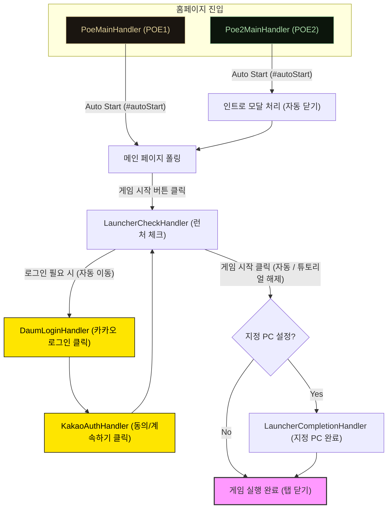

# Architecture: POE2-quick-launch-for-kakao

이 문서는 POE2-quick-launch-for-kakao 프로젝트의 기술 스택, 디렉토리 구조 및 코딩 컨벤션을 정의합니다.

## 1. Project Context

- **목적**: Kakao Games Path of Exile (1 & 2)의 빠른 실행 및 편의 기능을 제공하는 브라우저 확장 프로그램.
- **주요 기능**: 원클릭 게임 실행, 자동 로그인 보조, 패치 노트 확인 및 설정 관리.

### Tech Stack

- **Runtime**: Node.js (v24+)
- **Language**: TypeScript
- **Bundler**: Vite (with [@crxjs/vite-plugin](https://crxjs.dev/vite-plugin))
- **Platform**: Web Extensions (Chrome, Firefox 지원)
- **Styling**: Vanilla CSS

### Build & Packaging Commands

- `npm run dev`: 개발 모드 (Vite HMR). **Port 5173**을 사용합니다.
- `npm run package`: **[권장]** Chrome 및 Firefox용 통합 빌드/패키징 (Windows 호환)
- `npm run zip`: Chrome용 개별 빌드/패키징
- `npm run zip:firefox`: Firefox용 개별 빌드/패키징
- `npm run build`: 프로덕션 빌드 (개별 실행 불필요)
- `npm run test`: Vitest를 이용한 유닛 테스트

### Development Environment

- **IDE Automation**: VS Code (`.vscode/tasks.json`) is configured to automatically run `npm run setup` (conditional install) and start the dev server upon opening the project folder.
- **Cross-Platform Setup**: `npm run setup` uses a Node.js-based script to check for `node_modules` and runs `npm install` only when necessary, ensuring compatibility across Windows, macOS, and Linux.

> [!TIP]
> **개발 서버 상태 확인**:
> AI 에이전트는 작업 시작 전 `netstat -ano | findstr :5173` 명령 등을 통해 개발 서버가 실행 중인지 확인할 수 있습니다. 만약 서버가 꺼져 있다면 사용자에게 실행을 요청하거나 직접 실행 여부를 문의하게 됩니다.

## 2. Game Start Flows

플러그인을 통한 각 게임별 자동 실행 흐름입니다. POE1과 POE2는 진입점과 일부 전처리를 제외한 핵심 로직이 동일합니다.



---

## 3. Directory Structure

```text
/
├── dist/               # 빌드 결과물 (Chrome/Edge)
├── dist-firefox/       # 빌드 결과물 (Firefox)
├── docs/               # 문서 및 자산
├── public/             # 정적 자산 (아이콘 등)
├── src/                # 소스 코드
│   ├── assets/         # 스타일 및 이미지
│   ├── content/        # 컨텐츠 스크립트 도메인 로직
│   ├── utils/          # 공통 유틸리티
│   ├── background.ts   # 서비스 워커
│   ├── content.ts      # 메인 컨텐츠 스크립트
│   ├── popup.html/ts   # 팝업 UI
│   ├── storage.ts      # 브라우저 스토리지 래퍼
│   └── settings.ts     # 설정 도메인 로직
└── manifest.json       # 확장 프로그램 설정
```

## 4. Coding Conventions

Node.js 및 TypeScript 표준 컨벤션을 따릅니다.

### Naming Rules

- **Files**: `camelCase.ts` 또는 `kebab-case.ts` (일관성 유지)
- **Variables & Functions**: `camelCase`
- **Classes & Interfaces**: `PascalCase`
- **Constants**: `UPPER_SNAKE_CASE`

### Patterns

- **Modern Extension Architecture**: Vite와 CRXJS를 활용하여 서비스 워커와 컨텐츠 스크립트 간의 효율적인 번들링 처리
- **Storage Management**: `chrome.storage.local`을 래핑하여 비동기 데이터 처리를 간소화 (Storage Wrapper 패턴)
- **Cross Browser Support**: 매니페스트 설정 및 빌드 스크립트를 통해 Chrome과 Firefox 간의 호환성 확보

## 5. Glossary & Terminology

프로젝트 내에서 사용하는 주요 명칭 및 별칭입니다.

- **공식 명칭**: POE2-quick-launch-for-kakao
- **별칭**: 빠른실행 플러그인, 플러그인 (Plugin)
- **설명**: 사용자와의 소통 시 편의를 위해 "빠른실행 플러그인" 또는 간단히 "플러그인"이라 지칭할 수 있습니다.

## 6. Architecture Decision Records (ADR)

### ADR-001: Project Aliasing for Communication

- **Context**: 프로젝트의 공식 명칭이 길어 원활한 소통을 위해 짧은 별칭이 필요함.
- **Decision**: "빠른실행 플러그인" 및 "플러그인"을 공식 별칭으로 채택하여 문서 및 대화에서 혼용 가능하도록 함.
- **Status**: Accepted
- **Date**: 2026-01-04

### ADR-002: Simplified Build & Packaging

- **Context**: 빌드와 패키징(압축) 과정이 분리되어 있어 실수로 구버전이 패키징될 위험이 있음.
- **Decision**:
    1. `npm run package` (또는 `zip` 계열) 명령어가 `npm run build`를 선행하도록 스크립트를 구성하고 문서를 이를 반영함.
    2. 개발자는 별도의 `npm run build` 없이 `package` 명령어만으로 최신 빌드본을 생성하도록 함.
- **Status**: Accepted
- **Date**: 2026-01-04

### ADR-003: Automated Development Environment

- **Context**: 개발 환경 초기 세팅(의존성 설치)과 서버 실행 번거로움을 줄이고, OS 간 호환성을 확보해야 함.
- **Decision**:
    1. `package.json`에 `setup` 스크립트를 추가하여 Node.js 환경에서 `node_modules` 존재 여부를 체크하고 설치를 진행하도록 함 (OS 의존적 Shell 명령어 배제).
    2. `.vscode/tasks.json`을 통해 프로젝트 오픈 시 자동으로 `setup` 스크립트를 실행하고 개발 서버를 띄우도록 설정함.
- **Status**: Accepted
- **Date**: 2026-01-04

### ADR-004: Mandatory Build Verification

- **Context**: 코드 수정 후 빌드 안정성을 보장하기 위해 즉각적인 검증이 필요함.
- **Decision**: 코드를 수정한 후에는 반드시 `npm run package` 명령어를 실행하여 빌드 및 패키징(Chrome & Firefox)이 정상적으로 이루어지는지 검증해야 함.
- **Status**: Accepted
- **Date**: 2026-01-06
